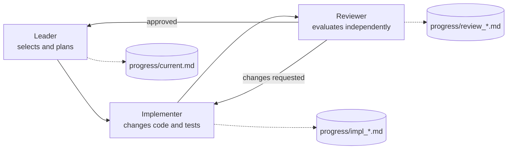

# Harness Bootstrap

A reusable project template for AI-assisted software work: small, verifiable changes, clear handoffs, and an audit trail that survives the chat session.

> **Adopting this harness?** Complete the [Harness Adoption Checklist](ADOPTION_CHECKLIST.md) before you trust a green gate. The bootstrap checks do not prove that your applications can build or deploy.

The demo application is deliberately small—a local task CLI. The point is the structure around it: explicit work queues, durable progress records, independent review, and executable verification. Share this repository with an AI agent as a reference when you want it to establish the same working structure in an existing project.

## Why this exists

AI agents are most useful when their work is constrained by a system, not a long chat prompt. This repository makes that system visible and versionable. It separates planning, implementation, and review into distinct agent roles, so each agent receives only the context needed for its job instead of carrying a mixed, ever-growing conversation.

The structure is intentionally small. A useful harness should provide the constraints and evidence an agent needs, without becoming a second application that overwhelms its context window.

| Principle | Where it lives |
| --- | --- |
| One scoped change at a time | `feature_list.json` and `scripts/verify.sh` |
| Durable state, not chat memory | `progress/` |
| Separate context and ownership by role | `agents/` |
| Definition of done | `CHECKPOINTS.md` and `docs/verification.md` |
| Auditable delivery | Work item → branch → pull request → CI → merge |
| Product-specific exit gates | `docs/production-readiness.md` |
| Adoption and build coverage | `ADOPTION_CHECKLIST.md` |
| Optional parallel scaling | `docs/parallel-worktrees.md` |
| Project knowledge on demand | `AGENTS.md` and `docs/` |
| Minimal, focused context | Short role files and targeted documents |

## Quick start

```bash
./scripts/verify.sh
pnpm start -- add "Ship the harness" --tag portfolio
pnpm start -- list
```

See the [task CLI guide](docs/task-cli.md) for product usage. `verify.sh` validates the queue and runs the real test suite. The leader runs it once after independent approval, and required CI runs it before merge.

For the full work-item-to-merge lifecycle, see [Run a ticket](docs/run-a-ticket.md). Most runs need only a short instruction such as `Implement issue #5 using the harness`; the repository supplies the roles, files, evidence requirements, and delivery rules.

The default workflow has one active feature. Advanced adopters can use [parallel worktrees](docs/parallel-worktrees.md) for independent tickets. Each worktree still runs the complete harness lifecycle and full merge gate.

## Adopt this structure in another project

Give an AI coding agent this repository's URL alongside the following prompt:

> Review this repository as a reference harness, then adapt its structure to the current project. Preserve the project's existing stack and conventions. Add only the relevant agent instructions, work queue, progress records, verification gate, and role boundaries; do not copy the demo task CLI. Keep the harness small, and load project context only when a role needs it.

The agent should first inspect the current project's existing instructions, test commands, and architecture. Treat this repository as a pattern to adapt, not a framework to install wholesale.

Complete the [Harness Adoption Checklist](ADOPTION_CHECKLIST.md) before you declare the adapted gate ready. Inventory every deployable target and relevant workspace. Run each production build in the full gate and prove that a broken build makes the gate fail.

Use the [adoption handoff protocol](docs/adoption-handoff.md) when the checklist is complete. Report harness adoption, project-gate adoption, and product readiness as separate outcomes. Identify the first actionable production-readiness item and offer to start it immediately when its authority and acceptance criteria are clear.

If the project already uses this harness, follow the [upgrade guide](docs/upgrading.md). Release tags define comparison points. Adapt each migration to the project, then update `HARNESS_VERSION` after the full gate passes.

Use the [production-readiness checklist](docs/production-readiness.md) to identify the last-mile gates that apply to the target product. Record why a gate applies, how it is measured, and how CI enforces it. Do not enable every listed gate by default.

## Run it with an AI coding agent

Use any agent runner that can work with project files. The role prompts in `agents/` are tool-neutral; adapt their delivery mechanism to your runner, then ask:

> Implement the next pending feature using the harness.

The intended loop is:



Each role has a narrow responsibility: the leader plans and coordinates, the implementer changes code, and the reviewer evaluates it independently. Agents return short status messages; the useful detail is written to files in `progress/`. That avoids losing decisions when a chat is compacted or a session ends.

## Repository map

```text
.
├── AGENTS.md                 # Entry point and navigation for all agents
├── ADOPTION_CHECKLIST.md     # Required target, build, and deployment audit
├── CHECKPOINTS.md            # Non-negotiable completion criteria
├── feature_list.json         # Small, machine-readable work queue
├── docs/                     # Architecture, workflow, verification, optional MCPs
├── progress/                 # Versioned session records and reports
├── agents/                   # Tool-neutral leader, implementer, reviewer prompts
├── .github/                  # GitHub issue/PR templates and CI workflow
├── scripts/verify.sh         # Harness gate: validates state + runs tests
├── src/                      # Minimal TypeScript task CLI
└── tests/                    # Node test suite
```

## The feature queue

Each feature has a stable ID, acceptance criteria, and one of five statuses:

`pending` → `in_progress` → `in_review` → `done`

Use `skipped` only when work is explicitly removed from the queue. Add a non-empty `skip_reason` so the decision remains accountable.

Only one item may be active (`in_progress` or `in_review`) at a time. This keeps the agent focused and makes handoffs obvious. Create a new feature by copying an existing object, using a new ID, and leaving its status as `pending`.

## Adapting this for a real product

1. Replace the demo CLI with your service, web app, or AI workflow.
2. Update `docs/architecture.md` with its boundaries and invariants.
3. Replace the seed features in `feature_list.json` with thin vertical slices.
4. Make `scripts/verify.sh` run your formatter, type checker, tests, and build.
5. Select applicable security, performance, accessibility, operational, and domain gates with the [production-readiness checklist](docs/production-readiness.md).
6. Keep reports compact and factual—files changed, commands run, results, and remaining risks.

The harness is intentionally framework-agnostic. The demo uses TypeScript and has a deliberately small dependency surface.

Repository instructions should define the shared workflow. Keep machine-specific identity, credentials, tool permissions, and personal preferences in your agent runner's local configuration; see [GitHub setup](docs/github-setup.md).

## Optional MCP integrations

MCP servers are not required for this harness. Add one only when it solves a concrete need in the target project. For browser-based projects, [Chrome DevTools MCP](docs/optional-mcp.md) can help agents inspect and verify a live UI while keeping the template itself tool-agnostic.

## License

MIT
