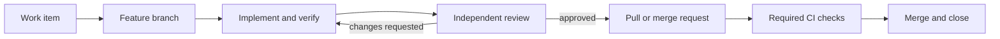

# Run a Ticket

The repository contains the operating instructions, so a normal request can stay short:

> Implement issue #5 using the harness.

The agent should derive the role sequence, required files, and evidence from `AGENTS.md`. Add detail to the prompt only when the work item leaves a real product decision unresolved.

## Lifecycle

1. **Define the work item.** Record one outcome, testable acceptance criteria, expected verification, and relevant risks or context. If the item is vague, improve it before coding.
2. **Start clean.** Update the default branch, run `./scripts/verify.sh`, confirm no feature is active, and add or select the matching entry in `feature_list.json`.
3. **Create a branch.** Use a traceable name such as `feature/TASK-006-delivery-workflow`. Never develop directly on the protected branch.
4. **Plan.** The leader marks the feature `in_progress` and writes the plan and handoff to `progress/current.md`.
5. **Implement.** The implementer changes only the accepted scope, verifies it, writes `progress/impl_<feature-id>.md`, and moves the feature to `in_review`.
6. **Review.** A reviewer independently checks the diff, acceptance criteria, tests, and risks. Findings go in `progress/review_<feature-id>.md`; the reviewer does not edit the implementation.
7. **Complete the harness gate.** Resolve blocking findings, run `./scripts/verify.sh` on the final state, satisfy `CHECKPOINTS.md`, and record the outcome. A feature marked `done` is locally ready for delivery; it is not necessarily merged yet.
8. **Open the change request.** Link the work item, summarize the change, name the two reports, paste exact verification results, and disclose remaining risks.
9. **Merge.** Wait for required remote checks, merge through the platform, and let the closing keyword close the work item. Confirm the default branch is green.



The feature queue tracks engineering readiness; the issue tracker and pull or merge request track delivery. Keeping those meanings separate avoids claiming that code is deployed or merged merely because local implementation is complete.

## GitHub command example

Use the web interface or equivalent API if your agent does not have the GitHub CLI.

```bash
gh issue create
git switch -c feature/TASK-006-delivery-workflow
# Run the harness roles and verification.
git push -u origin feature/TASK-006-delivery-workflow
gh pr create --fill
gh pr checks --watch
gh pr merge --squash --delete-branch
```

Put `Closes #5` in the pull request body, not only a commit message. GitHub will link the pull request immediately and close the issue when the request is merged into the default branch.

## When not to create a work item

An explicitly requested emergency or truly trivial administrative edit may skip a separate issue if repository policy permits it. It still uses a branch, reviewable change request, and required checks. Record why the normal traceability step was unnecessary.
