# Run a Ticket

The repository contains the operating instructions, so a normal request can stay short:

> Implement issue #5 using the harness.

One implementer plans, implements, and finalizes; one reviewer approves independently. A separate coordinator is optional. Derive required files and evidence from `AGENTS.md`. Add detail to the prompt only when the work item leaves a real product decision unresolved.

## Lifecycle

1. **Define the work item.** Record one outcome, at most five testable acceptance criteria, expected verification, and relevant risks or context. If the item is vague, improve it before coding.
2. **Bound the change.** Target at most 300 added implementation lines. Keep cohesive fixes in one item and PR. Split larger work at independently verifiable boundaries; avoid speculative dependent PR stacks. If the work cannot be split, record the reason and a named owner in the work item before activation.
3. **Start clean.** Update the default branch, run `pnpm run feedback`, confirm no feature is active, and add or select the matching entry in `feature_list.json`.
4. **Create a branch.** Use a traceable name such as `feature/TASK-006-delivery-workflow`. Never develop directly on the protected branch.
5. **Plan.** The implementer marks the feature `in_progress` and writes a short plan to `progress/current.md`.
6. **Implement.** The implementer runs focused checks and `pnpm run feedback`. The implementer stages the intended snapshot, records its digest, writes `progress/impl_<feature-id>.md`, and moves the feature to `in_review`.
7. **Review.** A reviewer independently checks the staged diff, acceptance criteria, tests, and risks. The reviewer runs relevant focused checks and recomputes the digest. Findings and the digest go in `progress/review_<feature-id>.md`.
8. **Run the final local gate.** After approval, the implementer runs `./scripts/verify.sh` once on the approved snapshot.
9. **Finalize evidence.** After the full gate passes, the implementer marks the feature `done`, updates progress and history, and runs `HARNESS_DELIVERY_PHASE=ci pnpm run check:delivery` and `pnpm run check:harness-state`. These evidence-only changes do not alter the reviewed implementation digest.
10. **Open the change request.** Link the work item, summarize the change, link the two reports, summarize exact command outcomes, and disclose remaining risks.
11. **Merge.** Wait for required remote checks, merge through the platform, and let the closing keyword close the work item. Confirm the default branch is green.

For changes after approval, use [approval refresh](review-binding.md#approval-refresh).

If verification fails during implementation, use the [bounded repair loop](repair-loop.md). Do not repeat speculative edits or reset its cycle budget.

```mermaid
flowchart LR
    issue[Work item] --> branch[Feature branch]
    branch --> implement[Implement and verify]
    implement --> review[Independent review]
    review -->|changes requested| implement
    review -->|approved| full[Implementer final gate]
    full --> finalize[Finalize evidence]
    finalize --> request[Pull or merge request]
    request --> checks[Required CI checks]
    checks --> merge[Merge and close]
```



The feature queue tracks engineering readiness; the issue tracker and pull or merge request track delivery. Keeping those meanings separate avoids claiming that code is deployed or merged merely because local implementation is complete.

## Low-risk documentation lane

Use this lane only for changes that `pnpm run verify:local` classifies as approved documentation. The allowlist contains only `docs/task-cli.md`. Root documents and all workflow, review, verification, and other process documents are excluded. Do not activate a feature, create progress reports, or use local role handoffs.

Create a branch and run the automatic selector with the correct Git base. If it selects normal fast feedback, use the normal lifecycle. If it selects the documentation gate, open a pull or merge request. Obtain accountable change-request review and wait for required full CI before merge. The lane does not bypass branch protection or remote review.

## GitHub command example

Use the web interface or equivalent API if your agent does not have the GitHub CLI.

```bash
gh issue create
git switch -c feature/TASK-006-delivery-workflow
# Run the harness roles and verification.
git push -u origin feature/TASK-006-delivery-workflow
gh pr create --fill
gh pr checks --watch
gh pr merge --squash --delete-branch
```

Put `Closes #5` in the pull request body, not only a commit message. GitHub will link the pull request immediately and close the issue when the request is merged into the default branch.

## When not to create a work item

An explicitly requested emergency or truly trivial administrative edit may skip a separate issue if repository policy permits it. It still uses a branch, reviewable change request, and required checks. Record why the normal traceability step was unnecessary.
